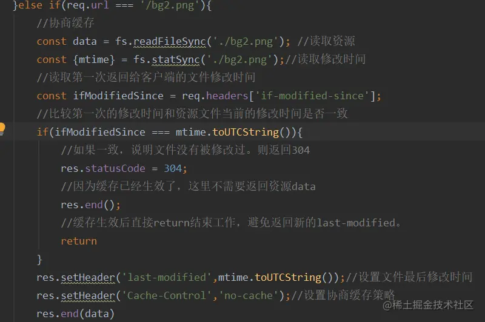

## 1. 通过Blob下载文件

```js
const blob = new Blob([data], {type: 'application/vnd.ms-excel'})
const fileName = 'test.xlsx'
//if('download' in document.createElement('a')){
    const linkNode = document.createElement('a')
    linkNode.download = fileName
    linkNode.href = URL.createObjectURL(blob)
    linkNode.click()
    URL.revokeObjectURL(linkNode.href)
//} else {
//    navigator.msSaveBlob(blob, fileName)
//}
```


## 2. 原生js获取PC和移动端屏幕宽、高的方法

```JS
// PC端
const width = window.innerWidth || document.documentElement.clientWidth || document.body.clientWidth
const height = window.innerHeight || document.documentElement.clientHeight || document.body.clientHeight

// 移动端
// 网页可见区域宽：
document.body.clientWidth  
// 网页可见区域高：
document.body.clientHeight  
// 网页可见区域宽：
document.body.offsetWidth (包括边线的宽)  
// 网页可见区域高：
document.body.offsetHeight (包括边线的宽)  
// 网页正文全文宽：
document.body.scrollWidth  
// 网页正文全文高：
document.body.scrollHeight  
// 网页被卷去的高：
document.body.scrollTop  
// 网页被卷去的左：
document.body.scrollLeft  
// 网页正文部分上：
window.screenTop  
// 网页正文部分左：
window.screenLeft  
// 屏幕分辨率的高：
window.screen.height  
// 屏幕分辨率的宽：
window.screen.width  
// 屏幕可用工作区高度：
window.screen.availHeight  
// 屏幕可用工作区宽度：
window.screen.availWidth
```


## 3. HTML标签及全称

| 标签        | 英文全称                  | 中文说明                       |
| :---------- | :------------------------ | :----------------------------- |
| a           | Anchor                    | 锚                             |
| abbr        | Abbreviation              | 缩写词                         |
| acronym     | Acronym                   | 取首字母的缩写词               |
| address     | Address                   | 地址                           |
| alt         | alter                     | 替用(一般是图片显示不出的提示) |
| b           | Bold                      | 粗体（文本）                   |
| bdo         | Direction of Text Display | 文本显示方向                   |
| big         | Big                       | 变大（文本）                   |
| blockquote  | Block Quotation           | 区块引用语                     |
| br          | Break                     | 换行                           |
| cell        | cell                      | 巢                             |
| cellpadding | cellpadding               | 巢补白                         |
| cellspacing | cellspacing               | 巢空间                         |
| center      | Centered                  | 居中（文本）                   |
| cite        | Citation                  | 引用                           |
| code        | Code                      | 源代码（文本）                 |
| dd          | Definition Description    | 定义描述                       |
| del         | Deleted                   | 删除（的文本）                 |
| dfn         | Defines a Definition Term | 定义定义条目                   |
| div         | Division                  | 分隔                           |
| dl          | Definition List           | 定义列表                       |
| dt          | Definition Term           | 定义术语                       |
| em          | Emphasized                | 加重（文本）                   |
| font        | Font                      | 字体                           |
| h1~h6       | Header 1 to Header 6      | 标题1到标题6                   |
| hr          | Horizontal Rule           | 水平尺                         |
| href        | hypertext reference       | 超文本引用                     |
| i           | Italic                    | 斜体（文本）                   |
| iframe      | Inline frame              | 定义内联框架                   |
| ins         | Inserted                  | 插入（的文本）                 |
| kbd         | Keyboard                  | 键盘（文本）                   |
| li          | List Item                 | 列表项目                       |
| nl          | navigation lists          | 导航列表                       |
| ol          | Ordered List              | 排序列表                       |
| optgroup    | Option group              | 定义选项组                     |
| p           | Paragraph                 | 段落                           |
| pre         | Preformatted              | 预定义格式（文本 ）            |
| q           | Quotation                 | 引用语                         |
| rel         | Reload                    | 加载                           |
| s/ strike   | Strikethrough             | 删除线                         |
| samp        | Sample                    | 示例（文本                     |
| small       | Small                     | 变小（文本）                   |
| span        | Span                      | 范围                           |
| src         | Source                    | 源文件链接                     |
| strong      | Strong                    | 加重（文本）                   |
| sub         | Subscripted               | 下标（文本）                   |
| sup         | Superscripted             | 上标（文本）                   |
| td          | table data cell           | 表格中的一个单元格             |
| th          | table header cell         | 表格中的表头                   |
| tr          | table row                 | 表格中的一行                   |
| tt          | Teletype                  | 打印机（文本）                 |
| u           | Underlined                | 下划线（文本）                 |
| ul          | Unordered List            | 不排序列表                     |
| var         | Variable                  | 变量（文本）                   |

Vue实现动态路由

我们开发后台管理系统过程中，会由不同的人操作系统，有admin（管理员）、superAdmin(超管)，及各种运营、财务人员。为了区别这些人员，会给不同的人分配不一样的角色来展示不同的菜单，这就必须要通过动态路由来实现。

**主流的实现方式：**

简单聊一下两种方式的优势，毕竟如果你从来没做过，说再多也看不明白，还是得看代码

**前端控制**

- 不用后端帮助，路由表维护在前端
- 逻辑相对比较简单，比较容易上手

**后端控制**

- 相对更安全一点
- 路由表维护在数据库

## 一、前端控制

思路：在路由配置里，通过`meta`属性，扩展权限相关的字段，在路由守卫里通过判断这个权限标识，实现路由的动态增加，及页面跳转；如：我们增加一个`role`字段来控制角色

**具体方案：**

> 1、根据登录用户的账号，返回前端用户的角色
>
> 2、前端根据用户的角色，跟路由表的meta.role进行匹配
>
> 3、讲匹配到的路由形成可访问路由

**核心代码逻辑**


### 1、在router.js文件（把静态路由和动态路由分别写在router.js）

```js
import Vue from 'vue'
import Router from 'vue-router'

Vue.use(Router)

import Layout from '@/layout'

// constantRoutes  静态路由，主要是登录页、404页等不需要动态的路由
export const constantRoutes = [
  {
    path: '/redirect',
    component: Layout,
    hidden: true,
    children: [
      {
        path: '/redirect/:path*',
        component: () => import('@/views/redirect/index')
      }
    ]
  },
  {
    path: '/login',
    component: () => import('@/views/login/index'),
    hidden: true
  },
  {
    path: '/404',
    component: () => import('@/views/error-page/404'),
    hidden: true
  },
  {
    path: '/401',
    component: () => import('@/views/error-page/401'),
    hidden: true
  }
] 

// asyncRoutes 动态路由
export const asyncRoutes = [
  {
    path: '/permission',
    component: Layout,
    redirect: '/permission/page',
    alwaysShow: true, 
    name: 'Permission',
    meta: {
      title: 'Permission',
      icon: 'lock',
      // 核心代码，可以通过配的角色来进行遍历，从而是否展示
      // 这个意思就是admin、editor这两个角色，这个菜单是可以显示
      roles: ['admin', 'editor']
    },
    children: [
      {
        path: 'page',
        component: () => import('@/views/permission/page'),
        name: 'PagePermission',
        meta: {
          title: 'Page Permission',
          // 这个意思就是只有admin能展示
          roles: ['admin']
        }
      }
     ]
    }
]

const createRouter = () => new Router({
  scrollBehavior: () => ({ y: 0 }),
  routes: constantRoutes
})

const router = createRouter()

// 这个是重置路由用的，很有用，别看这么几行代码
export function resetRouter() {
  const newRouter = createRouter()
  router.matcher = newRouter.matcher 
}

export default router
```

### 2、store/permission.js(在vuex维护一个state，通过配角色来控制菜单显不显示)

```js
import { asyncRoutes, constantRoutes } from '@/router'

// 这个方法是用来把角色和route.meta.role来进行匹配
function hasPermission(roles, route) {
  if (route.meta && route.meta.roles) {
    return roles.some(role => route.meta.roles.includes(role))
  } else {
    return true
  }
}


// 这个方法是通过递归来遍历路由，把有权限的路由给遍历出来
export function filterAsyncRoutes(routes, roles) {
  const res = []

  routes.forEach(route => {
    const tmp = { ...route }
    if (hasPermission(roles, tmp)) {
      if (tmp.children) {
        tmp.children = filterAsyncRoutes(tmp.children, roles)
      }
      res.push(tmp)
    }
  })

  return res
}

const state = {
  routes: [],
  addRoutes: []
}

const mutations = {
  SET_ROUTES: (state, routes) => {
    // 这个地方维护了两个状态一个是addRouters，一个是routes
    state.addRoutes = routes
    state.routes = constantRoutes.concat(routes)
  }
}

const actions = {
  generateRoutes({ commit }, roles) {
    return new Promise(resolve => {
      let accessedRoutes
      if (roles.includes('admin')) {
        accessedRoutes = asyncRoutes || []
      } else {
        // 核心代码，把路由和获取到的角色(后台获取的)传进去进行匹配
        accessedRoutes = filterAsyncRoutes(asyncRoutes, roles)
      }
      // 把匹配完有权限的路由给set到vuex里面
      commit('SET_ROUTES', accessedRoutes)
      resolve(accessedRoutes)
    })
  }
}

export default {
  namespaced: true,
  state,
  mutations,
  actions
}
```

### 3、src/permission.js

**（新建一个路由守卫函数，可以在main.js，也可以抽离出来一个文件）**

这里面的代码主要是控制路由跳转之前，先查一下有哪些可访问的路由，登录以后跳转的逻辑可以在这个地方写

```js
// permission.js
router.beforeEach((to, from, next) => {
  if (store.getters.token) { // 判断是否有token
    if (to.path === '/login') {
      next({ path: '/' });
    } else {
        // 判断当前用户是否已拉取完user_info信息
      if (store.getters.roles.length === 0) {
        store.dispatch('GetInfo').then(res => { // 拉取info
          const roles = res.data.role;
          // 把获取到的role传进去进行匹配，生成可以访问的路由
          store.dispatch('GenerateRoutes', { roles }).then(() => { 
            // 动态添加可访问路由表（核心代码，没有它啥也干不了）
            router.addRoutes(store.getters.addRouters)
            
            // hack方法 确保addRoutes已完成
            next({ ...to, replace: true })
          })
        }).catch(err => {
          console.log(err);
        });
      } else {
        next() //当有用户权限的时候，说明所有可访问路由已生成 如访问没权限的全面会自动进入404页面
      }
    }
  } else {
    if (whiteList.indexOf(to.path) !== -1) { // 在免登录白名单，直接进入
      next();
    } else {
      next('/login'); // 否则全部重定向到登录页
    }
  }
})
```

### 4、侧边栏的可以从vuex里面取数据来进行渲染

```vue
<!-- layout/components/siderbar.vue -->
<el-menu
:default-active="activeMenu"
:collapse="isCollapse"
:background-color="variables.menuBg"
:text-color="variables.menuText"
:unique-opened="false"
:active-text-color="variables.menuActiveText"
:collapse-transition="false"
mode="vertical"
>
    // 把取到的路由进行循环作为参数传给子组件
    <sidebar-item v-for="route in routes" :key="route.path" :item="route" :base-path="route.path" />
</el-menu>
// 获取有权限的路由
routes() {
  return this.$router.options.routes
}


<!-- layout/components/siderbarItem.vue -->
  <template slot="title">
    <item v-if="item.meta" :icon="item.meta && item.meta.icon" :title="item.meta.title" />
  </template>
  <sidebar-item
    v-for="child in item.children"
    :key="child.path"
    :is-nest="true"
    :item="child"
    :base-path="resolvePath(child.path)"
    class="nest-menu"
  />

  props: {
    // route object
    item: {
      type: Object,
      required: true
    },
    isNest: {
      type: Boolean,
      default: false
    },
    basePath: {
      type: String,
      default: ''
    }
  }
```

前端控制路由，逻辑相对简单，后端只需要存这个用户的角色就可以了，前端拿用户的角色进行匹配。但是如果新增角色，就会非常痛苦，每一个都要加。


## 二、后端控制路由

**后端控制大致思路是：**路由配置放在数据库表里，用户登录成功后，根据角色权限，把有权限的菜单传给前端，前端格式化成页面路由识别的结构，再渲染到页面菜单上；

- 用户登录以后，后端根据该用户的角色，直接生成可访问的路由数据，注意这个地方是数据
- 前端根据后端返回的路由数据，转成自己需要的路由结构

**具体逻辑：**

- router.js里面只放一些静态的路由，`login`、404之类
- 整理一份数据结构，存到表里
- 从后端获取路由数据，写一个数据转换的方法，讲数据转成可访问的路由
- 也是维护一个`vuex`状态，将转换好的路由存到`vuex`里面
- 侧边栏也是从路由取数据进行渲染

因为前段控制和后端控制，后面的流程大部分都是一样的，所以这个地方只看看前面不一样的流程：


### 1、store/permission.js，在vuex里面发送请求获取数据

```js
GenerateRoutes({ commit }, data) {
  return new Promise((resolve, reject) => {
    getRoute(data).then(res => {
     // 将获取到的数据进行一个转换，然后存到vuex里
      const accessedRouters = arrayToMenu(res.data)
      accessedRouters.concat([{ path: '*', redirect: '/404', hidden: true }])
      commit('SET_ROUTERS', accessedRouters)
      resolve()
    }).catch(error => {
      reject(error)
    })
  })
}
```

### 2、整理一份数据结构，存到表里

```js
// 页面路由格式
{
    path: '/form',
    component: Layout,
    children: [
      {
        path: 'index',
        name: 'Form',
        component: () => import('@/views/form/index'),
        meta: { title: 'Form', icon: 'form' }
      }
    ]
}

// 整理后的数据格式
// 一级菜单
// parentId为0的就可以当做一级菜单，id最好是可以选4位数，至于为什么等你开发项目的时候就知道了
{
    id: 1300
    parentId: 0
    title: "菜单管理"
    path: "/menu"
    hidden: false
    component: null
    hidden: false
    name: "menu"
}，

// 二级菜单
// parentId不为0的，就可以拿parentId跟一级菜单的id去匹配，匹配上的就push到children里面
{
    id: 1307
    parentId: 1300
    title: "子菜单"
    hidden: false
    path: "menuItem"
    component: "menu/menuItem" // 要跟本地的文件地址匹配上
    hidden: false
    name: "menuItem"
}
```

### 3、写一个转化方法，把获取到的数据转换成router结构

```js
export function arrayToMenu(array) {
  const nodes = []
  // 获取顶级节点
  for (let i = 0; i < array.length; i++) {
    const row = array[i]
    // 这个exists方法就是判断下有没有子级
    if (!exists(array, row.parentId)) {
      nodes.push({
        path: row.path, // 路由地址
        hidden: row.hidden, // 全部true就行，如果后端没配
        component: Layout, // 一般就是匹配你文件的component
        name: row.name, // 路由名称
        meta: { title: row.title, icon: row.name }, // title就是显示的名字
        id: row.id, // 路由的id
        redirect: 'noredirect'
      })
    }
  }
  const toDo = Array.from(nodes)
  while (toDo.length) {
    const node = toDo.shift()
    // 获取子节点
    for (let i = 0; i < array.length; i++) {
      const row = array[i]
      // parentId等于哪个父级的id，就push到哪个
      if (row.parentId === node.id) {
        const child = {
          path: row.path,
          name: row.name,
          hidden: row.hidden,
          // 核心代码，因为二级路由的component是需要匹配页面的
          component: require('@/views/' + row.component + '/index.vue'),
          meta: { title: row.title, icon: row.name },
          id: row.id
        }
        if (node.children) {
          node.children.push(child)
        } else {
          node.children = [child]
        }
        toDo.push(child)
      }
    }
  }
  return nodes
}
// 看下有没有子级
function exists(rows, parentId) {
  for (let i = 0; i < rows.length; i++) {
    if (rows[i].id === parentId) return true
  }
  return false
}
```


# 一. web缓存

web缓存是高级前端工程师必修技能。是我们变成大牛过程中绕不开的知识点。

文章会尽量用通俗易懂的言语来细说web缓存的概念和用处。

本期文章的大纲是

1. 什么是web缓存（前端缓存）

2. 缓存可以解决什么问题？他的缺点是什么？

3. 强制缓存原理讲解

   3.1.基于Expires字段实现的强缓存

   3.2.基于Cache-control实现的强缓存

4. 协商缓存原理讲解

   4.1.基于last-modified实现的协商缓存

   4.2.基于ETag实现的协商缓存

## 1. 什么是web缓存？

**web缓存主要指的是两部分：浏览器缓存和http缓存。**

**其中http缓存是web缓存的核心，是最难懂的那一部分,也是最重要的那一部分。**

浏览器缓存：比如,localStorage,sessionStorage,cookie等等。这些功能主要用于缓存一些必要的数据，比如用户信息。比如需要携带到后端的参数。亦或者是一些列表数据等等。

不过这里需要注意。**像localStorage，sessionStorage这种用户缓存数据的功能，他只能保存5M左右的数据，多了不行。cookie则更少，大概只能有4kb的数据**。不要担心，这些概念对于未来会称为前端大牛的你来说都不是什么问题，非常的简单。因为太简单，数据缓存不再这篇文章的介绍中，这里一笔带过，需要了解的小伙伴，可以移步我的另一篇文章[前端新能优化篇之localStorage和sessionStorage的区别及其使用方式 - 掘金 (juejin.cn)](https://juejin.cn/post/7111572114028625934)。

这篇文章重点讲解的是：前端http缓存。

http缓存

> 官方介绍:Web 缓存是可以自动保存常见文档副本的 HTTP 设备。当 Web 请求抵达缓存时， 如果本地有“已缓存的”副本，就可以从本地存储设备而不是原始服务器中提取这 个文档。

举个例子↓


看图，问题就是出在，**服务器需要处理http的请求，并且http去传输数据，需要带宽，带宽是要钱买的啊。而我们缓存，就是为了让服务器不去处理这个请求，客户端也可以拿到数据。**

> 注意，我们的缓存主要是针对html,css,img等静态资源，常规情况下，我们不会去缓存一些动态资源，因为缓存动态资源的话，数据的实时性就不会不太好，所以我们一般都只会去缓存一些不太容易被改变的静态资源。

## 2. 缓存可以解决什么问题？他的缺点是什么？

先说说，缓存可以解决什么问题。

- **减少不必要的网络传输，节约宽带（就是省钱）**
- **更快的加载页面（就是加速）**
- **减少服务器负载，避免服务器过载的情况出现。（就是减载）**

再说说缺点

- 占内存（有些缓存会被存到内存中）

其实日常的开发中，我们最最最最关心的，还是"更快的加载页面";尤其是对于react/vue等SPA（单页面）应用来说，首屏加载是老生常谈的问题。这个时候，缓存就显得非常重要。不需要往后端请求，直接在缓存中读取。速度上，会有显著的提升。是一种提升网站性能与用户体验的有效策略。

http缓存又分为两种两种缓存，**强制缓存**和**协商缓存**,我们来深度剖析一下**强制缓存和协商缓存各自的优劣以及他们的使用场景以及使用原理**

**http缓存流程图↓**


## 3. 强制缓存

强制缓存，我们简称强缓存。

从强制缓存的角度触发，如果浏览器判断请求的目标资源有效命中强缓存，如果命中，则可以直接从内存中读取目标资源，无需与服务器做任何通讯。

### 3.1 基于Expires字段实现的强缓存

在以前，我们通常会使用响应头的`Expires`字段去实现强缓存。如下图↓


`Expires`字段的作用是，设定一个强缓存时间。在此时间范围内，则从内存（或磁盘）中读取缓存返回。

比如说将某一资源设置响应头为:Expires:new Date("2022-7-30 23:59:59")；

那么，该资源在2022-7-30 23:59:59 之前，都会去本地的磁盘（或内存）中读取，不会去服务器请求。

但是，**`Expires`已经被废弃了**。对于强缓存来说，`Expires`已经不是实现强缓存的首选。

**因为Expires判断强缓存是否过期的机制是:获取本地时间戳，并对先前拿到的资源文件中的`Expires`字段的时间做比较。来判断是否需要对服务器发起请求。这里有一个巨大的漏洞：“如果我本地时间不准咋办？”**

**是的，`Expires`过度依赖本地时间，如果本地与服务器时间不同步，就会出现资源无法被缓存或者资源永远被缓存的情况。所以，`Expires`字段几乎不被使用了。现在的项目中，我们并不推荐使用`Expires`，强缓存功能通常使用`cache-control`字段来代替`Expires`字段。**

没想到吧，整半天，这个属性是废的。


### 3.2 基于Cache-control实现的强缓存（代替Expires的强缓存实现方法）

`Cache-control`这个字段在http1.1中被增加，`Cache-control`完美解决了`Expires`本地时间和服务器时间不同步的问题。是当下的项目中实现强缓存的最常规方法。

`Cache-control`的使用方法页很简单，只要在资源的响应头上写上需要缓存多久就好了，单位是秒。比如↓

```js
//往响应头中写入需要缓存的时间
res.writeHead(200,{
    'Cache-Control':'max-age=10'
});
复制代码
```

下图的意思就是，从该资源第一次返回的时候开始，往后的10秒钟内如果该资源被再次请求，则从缓存中读取。 

**Cache-Control:max-age=N，N就是需要缓存的秒数。从第一次请求资源的时候开始，往后N秒内，资源若再次请求，则直接从磁盘（或内存中读取），不与服务器做任何交互。**

`Cache-control`中因为max-age后面的值是一个滑动时间，从服务器第一次返回该资源时开始倒计时。所以也就不需要比对客户端和服务端的时间，解决了`Expires`所存在的巨大漏洞。

`Cache-control`有**max-age**、**s-maxage**、**no-cache**、**no-store**、**private**、**public**这六个属性。

- **max-age**决定客户端资源被缓存多久。
- **s-maxage**决定代理服务器缓存的时长。
- **no-cache**表示是强制进行协商缓存。
- **no-store**是表示禁止任何缓存策略。
- **public**表示资源即可以被浏览器缓存也可以被代理服务器缓存。
- **private**表示资源只能被浏览器缓存。


#### 3.2.1 no-cache和no-store

**no_cache**是`Cache-control`的一个属性。它并不像字面意思一样禁止缓存，实际上，**no-cache**的意思是强制进行协商缓存。如果某一资源的`Cache-control`中设置了**no-cache**，那么该资源会直接跳过强缓存的校验，直接去服务器进行协商缓存。而**no-store**就是禁止所有的缓存策略了。

> 注意，no-cache和no-store是一组互斥属性，这两个属性不能同时出现在`Cache-Control`中。


#### 3.2.2 public和private

一般请求是从客户端直接发送到服务端，如下↓


但有些情况下是例外的：比如，出现代理服务器，如下↓


而**public**和**private**就是决定资源是否可以在代理服务器进行缓存的属性。

其中，**public**表示资源在客户端和代理服务器都可以被缓存。

**private**则表示资源只能在客户端被缓存，拒绝资源在代理服务器缓存。

如果这两个属性值都没有被设置，则默认为**private**

> 注意，**public**和**private**也是一组互斥属性。他们两个不能同时出现在响应头的`cache-control`字段中。


#### 3.2.3 max-age和s-maxage

**max-age**表示的时间资源在客户端缓存的时长，而**s-maxage**表示的是资源在代理服务器可以缓存的时长。

在一般的项目架构中**max-age**就够用。

而**s-maxage**因为是代理服务端的缓存时长，他必须和上面说的**public**属性一起使用（public属性表示资源可以在代理服务器中缓存）。

> 注意，**max-age**和**s-maxage**并不互斥。他们可以一起使用。

那么,Cache-control如何设置多个值呢？用逗号分割，如下↓

```
Cache-control:max-age=10000,s-maxage=200000,public
```

**强制缓存就是以上这两种方法了。现在我们回过头来聊聊，`Expires`难道就一点用都没有了吗？也不是，虽然`Cache-control是Expires`的完全替代品，但是如果要考虑向下兼容的话，在`Cache-control`不支持的时候，还是要使用`Expires`，这也是我们当前使用的这个属性的唯一理由。**

## 4. 协商缓存

> 温馨提示:协商缓存的内容会有一点点绕。需要仔细阅读。

### 4.1 基于last-modified的协商缓存

基于last-modified的协商缓存实现方式是:

1. 首先需要在服务器端读出文件修改时间，
2. 将读出来的修改时间赋给响应头的`last-modified`字段。
3. 最后设置`Cache-control:no-cache`

三步缺一不可。

如下图↓


注意圈出来的三行。

第一行，读出修改时间。

第二行，给该资源响应头的`last-modified`字段赋值修改时间

第三行，给该资源响应头的`Cache-Control`字段值设置为:no-cache.(上文有介绍，Cache-control:no-cache的意思是跳过强缓存校验，直接进行协商缓存。)

**还没完。到这里还无法实现协商缓存**

当客户端读取到`last-modified`的时候，会在下次的请求标头中携带一个字段:`If-Modified-Since`。


而这个请求头中的`If-Modified-Since`就是服务器第一次修改时候给他的时间，也就是上图中的

 这一行。

**那么之后每次对该资源的请求，都会带上`If-Modified-Since`这个字段，而务端就需要拿到这个时间并再次读取该资源的修改时间，让他们两个做一个比对来决定是读取缓存还是返回新的资源。**

如图↓



这样，就是协商缓存的所有操作了。

看到这里，有些小伙伴可能有些迷糊了。


没关系，我们用一张图来解释下协商缓存。


**使用以上方式的协商缓存已经存在两个非常明显的漏洞。这两个漏洞都是基于文件是通过比较修改时间来判断是否更改而产生的。**

**1.因为是更具文件修改时间来判断的，所以，在文件内容本身不修改的情况下，依然有可能更新文件修改时间（比如修改文件名再改回来），这样，就有可能文件内容明明没有修改，但是缓存依然失效了。**

**2.当文件在极短时间内完成修改的时候（比如几百毫秒）。因为文件修改时间记录的最小单位是秒，所以，如果文件在几百毫秒内完成修改的话，文件修改时间不会改变，这样，即使文件内容修改了，依然不会 返回新的文件。**

**为了解决上述的这两个问题。从`http1.1`开始新增了一个头信息，`ETag`(Entity 实体标签)**

又来新东西了，兄弟们顶住


### 4.2 基础ETag的协商缓存

不用太担心，如果你已经理解了上面比较时间戳形式的协商缓存的话，`ETag`对你来说不会有难度。

`ETag`就是将原先协商缓存的比较**时间戳**的形式修改成了比较**文件指纹**。

> 文件指纹:根据文件内容计算出的唯一哈希值。文件内容一旦改变则指纹改变。

我们来看一下流程↓

1.第一次请求某资源的时候，服务端读取文件并计算出文件指纹，将文件指纹放在响应头的`etag`字段中跟资源一起返回给客户端。

2.第二次请求某资源的时候，客户端自动从缓存中读取出上一次服务端返回的`ETag`也就是文件指纹。并赋给请求头的`if-None-Match`字段，让上一次的文件指纹跟随请求一起回到服务端。

3.服务端拿到请求头中的`is-None-Match`字段值（也就是上一次的文件指纹），并再次读取目标资源并生成文件指纹，两个指纹做对比。如果两个文件指纹完全吻合，说明文件没有被改变，则直接返回304状态码和一个空的响应体并return。如果两个文件指纹不吻合，则说明文件被更改，那么将新的文件指纹重新存储到响应头的`ETag`中并返回给客户端

代码图例↓


流程示例图↓


> 从校验流程上来说，协商缓存的修改时间比对和文件指纹比对，几乎是一样的。


#### ETag也有缺点

- **ETag需要计算文件指纹这样意味着，服务端需要更多的计算开销。。如果文件尺寸大，数量多，并且计算频繁，那么ETag的计算就会影响服务器的性能。显然，ETag在这样的场景下就不是很适合。**
- **ETag有强验证和弱验证，所谓将强验证，ETag生成的哈希码深入到每个字节。哪怕文件中只有一个字节改变了，也会生成不同的哈希值，它可以保证文件内容绝对的不变。但是，强验证非常消耗计算量。ETag还有一个弱验证，弱验证是提取文件的部分属性来生成哈希值。因为不必精确到每个字节，所以他的整体速度会比强验证快，但是准确率不高。会降低协商缓存的有效性。**

> 值得注意的一点是，不同于`cache-control`是`expires`的完全替代方案(说人话:能用`cache-control`就不要用`expiress`)。`ETag`并不是`last-modified`的完全替代方案。而是`last-modified`的补充方案（说人话：项目中到底是用`ETag`还是`last-modified`完全取决于业务场景，这两个没有谁更好谁更坏）。


## 5. 如何设置缓存

**从前端的角度来说:**

你什么都不用干，缓存是缓存在前端，但实际上代码是后端的同学来写的。如果你需要实现前端缓存的话啊，通知后端的同学加响应头就好了。

**从后端的角度来说**

请参考文章，虽然文章里的后端是使用node.js写的，但我写了详细的注释。对于后端的同学来说。应该不难看懂。

## 6. 哪些文件对应哪些缓存

这个，我确实忘了说。哈哈哈。

有哈希值的文件设置强缓存即可。没有哈希值的文件（比如index.html）设置协商缓存

**为什么有哈希值的文件设置强缓存**


这是我打完包之后的css文件。大家是否注意到。我划了红线的部分。明显，这绝不是我的文件名。这串和乱码一样的字符串叫`哈希值`。每次打包之后都会生产一串新的`哈希值`并追加到我们的文件名中。哈希值是打包后的文件名的一部分。

我们给css设置强缓存，哪怕缓存1W年。只要我们重新打包，生产新的哈希值。那么文件名就更改了。对于机器来说，更改了文件名的文件，就是一个新的文件。

*举个例子👇*

比如，有一个css文件a1

第一次打包a1.css文件追加哈希值变成了 a1.aaaaa.css,我们给a1.aaaaa.css设置了强缓存1W年。

然后项目改动，我们又打包了一次。打包后生产新的哈希值，a1.aaaaa.css变成了a1.bbbbb.css文件。那么当我们第一次访问a1.bbbbb.css文件的时候是不会被缓存。因为1W年的缓存是给a1.aaaaa.css文件做的。关我a1.bbbbb.css文件什么事？这样我们也就能拿到最新的改动。

其他可以被webpack生成哈希值的文件同理。

**为什么index.html使用协商缓存**

既然img/css这些文件都可以用强缓存。通过更改文件名的方式来获取最新的数据，为什么我堂堂index.html就要用协商呢？

我给大家看个图


因为一般情况下，index.html是不会设置哈希值的。（具体得看自己项目下的dist文件夹）

> 注意：哈希值是需要webpack生成的。不是天生的。不过有些框架会自带（比如我使用的umi.js）,设置缓存前务必看下自己的dist文件。因为如果没有配置的话，你可能所有文件都不带哈希值。

## 7. 总结一下

- http缓存可以减少宽带流量，加快响应速度。
- 关于强缓存，`cache-control`是`Expires`的完全替代方案，在可以使用`cache-control`的情况下不要使用`expires`
- 关于协商缓存,`etag`并不是`last-modified`的完全替代方案，而是补充方案，具体用哪一个，取决于业务场景。
- 有些缓存是从磁盘读取，有些缓存是从内存读取，有什么区别？答：从内存读取的缓存更快。
- 所有带304的资源都是协商缓存，所有标注（从内存中读取/从磁盘中读取）的资源都是强缓存。


Promise

Promise 新建后就会立即执行。

```
let promise = new Promise(function(resolve, reject) {
  console.log('Promise');
  resolve();
});

promise.then(function() {
  console.log('resolved.');
});

console.log('Hi!');

// Promise
// Hi!
// resolved
```

上面代码中，Promise 新建后立即执行，所以首先输出的是`Promise`。然后，`then`方法指定的回调函数，将在当前脚本所有同步任务执行完才会执行，所以`resolved`最后输出。

注意，下面代码的`p1`的状态会传递给`p2`，也就是说，`p1`的状态决定了`p2`的状态。如果`p1`的状态是`pending`，那么`p2`的回调函数就会等待`p1`的状态改变；如果`p1`的状态已经是`resolved`或者`rejected`，那么`p2`的回调函数将会立刻执行。

```
const p1 = new Promise(function (resolve, reject) {
  setTimeout(() => reject(new Error('fail')), 3000)
})

const p2 = new Promise(function (resolve, reject) {
  setTimeout(() => resolve(p1), 1000)
})

p2
  .then(result => console.log(result))
  .catch(error => console.log(error))
// Error: fail
```

上面代码中，`p1`是一个 Promise，3 秒之后变为`rejected`。`p2`的状态在 1 秒之后改变，`resolve`方法返回的是`p1`。由于`p2`返回的是另一个 Promise，导致`p2`自己的状态无效了，由`p1`的状态决定`p2`的状态。所以，后面的`then`语句都变成针对后者（`p1`）。又过了 2 秒，`p1`变为`rejected`，导致触发`catch`方法指定的回调函数。

注意，调用`resolve`或`reject`并不会终结 Promise 的参数函数的执行。

```
new Promise((resolve, reject) => {
  resolve(1);
  console.log(2);
}).then(r => {
  console.log(r);
});
// 2
// 1
```

上面代码中，调用`resolve(1)`以后，后面的`console.log(2)`还是会执行，并且会首先打印出来。这是因为立即 resolved 的 Promise 是在本轮事件循环的末尾执行，总是晚于本轮循环的同步任务。

一般来说，调用`resolve`或`reject`以后，Promise 的使命就完成了，后继操作应该放到`then`方法里面，而不应该直接写在`resolve`或`reject`的后面。所以，最好在它们前面加上`return`语句，这样就不会有意外。

```
new Promise((resolve, reject) => {
  return resolve(1);
  // 后面的语句不会执行
  console.log(2);
})
```

## Promise.all()

`Promise.all()`方法用于将多个 Promise 实例，包装成一个新的 Promise 实例。

```
const p = Promise.all([p1, p2, p3]);
```

上面代码中，`Promise.all()`方法接受一个数组作为参数，`p1`、`p2`、`p3`都是 Promise 实例，如果不是，就会先调用下面讲到的`Promise.resolve`方法，将参数转为 Promise 实例，再进一步处理。另外，`Promise.all()`方法的参数可以不是数组，但必须具有 Iterator 接口，且返回的每个成员都是 Promise 实例。

`p`的状态由`p1`、`p2`、`p3`决定，分成两种情况。

（1）只有`p1`、`p2`、`p3`的状态都变成`fulfilled`，`p`的状态才会变成`fulfilled`，此时`p1`、`p2`、`p3`的返回值组成一个数组，传递给`p`的回调函数。

（2）只要`p1`、`p2`、`p3`之中有一个被`rejected`，`p`的状态就变成`rejected`，此时第一个被`reject`的实例的返回值，会传递给`p`的回调函数。

下面是一个具体的例子。

```
// 生成一个Promise对象的数组
const promises = [2, 3, 5, 7, 11, 13].map(function (id) {
  return getJSON('/post/' + id + ".json");
});

Promise.all(promises).then(function (posts) {
  // ...
}).catch(function(reason){
  // ...
});
```

上面代码中，`promises`是包含 6 个 Promise 实例的数组，只有这 6 个实例的状态都变成`fulfilled`，或者其中有一个变为`rejected`，才会调用`Promise.all`方法后面的回调函数。

注意，如果作为参数的 Promise 实例，自己定义了`catch`方法，那么它一旦被`rejected`，并不会触发`Promise.all()`的`catch`方法。

```
const p1 = new Promise((resolve, reject) => {
  resolve('hello');
})
.then(result => result)
.catch(e => e);

const p2 = new Promise((resolve, reject) => {
  throw new Error('报错了');
})
.then(result => result)
.catch(e => e);

Promise.all([p1, p2])
.then(result => console.log(result))
.catch(e => console.log(e));
// ["hello", Error: 报错了]
```

上面代码中，`p1`会`resolved`，`p2`首先会`rejected`，但是`p2`有自己的`catch`方法，该方法返回的是一个新的 Promise 实例，`p2`指向的实际上是这个实例。该实例执行完`catch`方法后，也会变成`resolved`，导致`Promise.all()`方法参数里面的两个实例都会`resolved`，因此会调用`then`方法指定的回调函数，而不会调用`catch`方法指定的回调函数。

如果`p2`没有自己的`catch`方法，就会调用`Promise.all()`的`catch`方法。

```
const p1 = new Promise((resolve, reject) => {
  resolve('hello');
})
.then(result => result);

const p2 = new Promise((resolve, reject) => {
  throw new Error('报错了');
})
.then(result => result);

Promise.all([p1, p2])
.then(result => console.log(result))
.catch(e => console.log(e));
// Error: 报错了
```

## Promise.race() [#](https://wangdoc.com/es6/promise.html#promiserace) 

`Promise.race()`方法同样是将多个 Promise 实例，包装成一个新的 Promise 实例。

```
const p = Promise.race([p1, p2, p3]);
```

上面代码中，只要`p1`、`p2`、`p3`之中有一个实例率先改变状态，`p`的状态就跟着改变。那个率先改变的 Promise 实例的返回值，就传递给`p`的回调函数。

`Promise.race()`方法的参数与`Promise.all()`方法一样，如果不是 Promise 实例，就会先调用下面讲到的`Promise.resolve()`方法，将参数转为 Promise 实例，再进一步处理。

下面是一个例子，如果指定时间内没有获得结果，就将 Promise 的状态变为`reject`，否则变为`resolve`。

```
const p = Promise.race([
  fetch('/resource-that-may-take-a-while'),
  new Promise(function (resolve, reject) {
    setTimeout(() => reject(new Error('request timeout')), 5000)
  })
]);

p
.then(console.log)
.catch(console.error);
```

上面代码中，如果 5 秒之内`fetch`方法无法返回结果，变量`p`的状态就会变为`rejected`，从而触发`catch`方法指定的回调函数。

## Promise.allSettled() 

有时候，我们希望等到一组异步操作都结束了，不管每一个操作是成功还是失败，再进行下一步操作。`Promise.all()`方法只适合所有异步操作都成功的情况，如果有一个操作失败，就无法满足要求。

为了解决这个问题，[ES2020](https://github.com/tc39/proposal-promise-allSettled) 引入了`Promise.allSettled()`方法，用来确定一组异步操作是否都结束了（不管成功或失败）。所以，它的名字叫做”Settled“，包含了”fulfilled“和”rejected“两种情况。

`Promise.allSettled()`方法接受一个数组作为参数，数组的每个成员都是一个 Promise 对象，并返回一个新的 Promise 对象。只有等到参数数组的所有 Promise 对象都发生状态变更（不管是`fulfilled`还是`rejected`），返回的 Promise 对象才会发生状态变更。

```
const promises = [
  fetch('/api-1'),
  fetch('/api-2'),
  fetch('/api-3'),
];

await Promise.allSettled(promises);
removeLoadingIndicator();
```

上面示例中，数组`promises`包含了三个请求，只有等到这三个请求都结束了（不管请求成功还是失败），`removeLoadingIndicator()`才会执行。

该方法返回的新的 Promise 实例，一旦发生状态变更，状态总是`fulfilled`，不会变成`rejected`。状态变成`fulfilled`后，它的回调函数会接收到一个数组作为参数，该数组的每个成员对应前面数组的每个 Promise 对象。

```
const resolved = Promise.resolve(42);
const rejected = Promise.reject(-1);

const allSettledPromise = Promise.allSettled([resolved, rejected]);

allSettledPromise.then(function (results) {
  console.log(results);
});
// [
//    { status: 'fulfilled', value: 42 },
//    { status: 'rejected', reason: -1 }
// ]
```

上面代码中，`Promise.allSettled()`的返回值`allSettledPromise`，状态只可能变成`fulfilled`。它的回调函数接收到的参数是数组`results`。该数组的每个成员都是一个对象，对应传入`Promise.allSettled()`的数组里面的两个 Promise 对象。

`results`的每个成员是一个对象，对象的格式是固定的，对应异步操作的结果。

```
// 异步操作成功时
{status: 'fulfilled', value: value}

// 异步操作失败时
{status: 'rejected', reason: reason}
```

成员对象的`status`属性的值只可能是字符串`fulfilled`或字符串`rejected`，用来区分异步操作是成功还是失败。如果是成功（`fulfilled`），对象会有`value`属性，如果是失败（`rejected`），会有`reason`属性，对应两种状态时前面异步操作的返回值。

下面是返回值的用法例子。

```
const promises = [ fetch('index.html'), fetch('https://does-not-exist/') ];
const results = await Promise.allSettled(promises);

// 过滤出成功的请求
const successfulPromises = results.filter(p => p.status === 'fulfilled');

// 过滤出失败的请求，并输出原因
const errors = results
  .filter(p => p.status === 'rejected')
  .map(p => p.reason);
```


### 1. 脚本文件使用独立文件的好处

​        使用独立文件的好处是浏览器会下载它，然后将它保存到浏览器的 **缓存** 中。之后，其他页面想要相同的脚本就会从缓存中获取，而不是下载它。所以文件实际上只会下载一次。这可以节省流量，并使得页面（加载）更快。


### 2. NaN

`NaN` 是粘性的。任何对 `NaN` 的进一步数学运算都会返回 `NaN`：

```javascript
alert( NaN + 1 ); // NaN
alert( 3 * NaN ); // NaN
alert( "not a number" / 2 - 1 ); // NaN
```

所以，如果在数学表达式中有一个 `NaN`，会被传播到最终结果（只有一个**例外**：`NaN ** 0` 结果为 `1`）。

### 3. 不同类型间的比较

当对不同类型的值进行比较时，JavaScript 会首先将其转化为**数字**（number）再判定大小。`undefined` 和 `null` 在相等性检查 `==` 中不会进行任何的类型转换，它们有自己独立的比较规则，所以除了**它们之间互等**外，不会等于任何其他的值。

### 4. 空值合并运算符 '??'

- `||` 返回第一个 **真** 值。
- `??` 返回第一个 **已定义的** 值。

换句话说，`||` 无法区分 `false`、`0`、空字符串 `""` 和 `null/undefined`。它们都一样 —— 假值（falsy values）。如果其中任何一个是 `||` 的第一个参数，那么我们将得到第二个参数作为结果。

不过在实际中，我们可能只想在变量的值为 `null/undefined` 时使用默认值。也就是说，当该值确实未知或未被设置时。

例如，考虑下面这种情况：

```javascript
let height = 0;

alert(height || 100); // 100
alert(height ?? 100); // 0
```


小陈小陈，我后面可能不来打扰你了。前两天你说你妈妈催婚，我也感同身受。所以当我在青藤看到你，我感觉你的条件非常优越，人又很聪明，所以我一直想很主动跟你接触熟悉，接触下来确实那么好，跟你聊天也很开心。但是我没有那种爱情的感觉，因为结婚是一辈子的事情，我希望对对方对自己都负责，我这两天跟你聊天我都有负罪感不知道怎么去面对，我不想欺骗你。